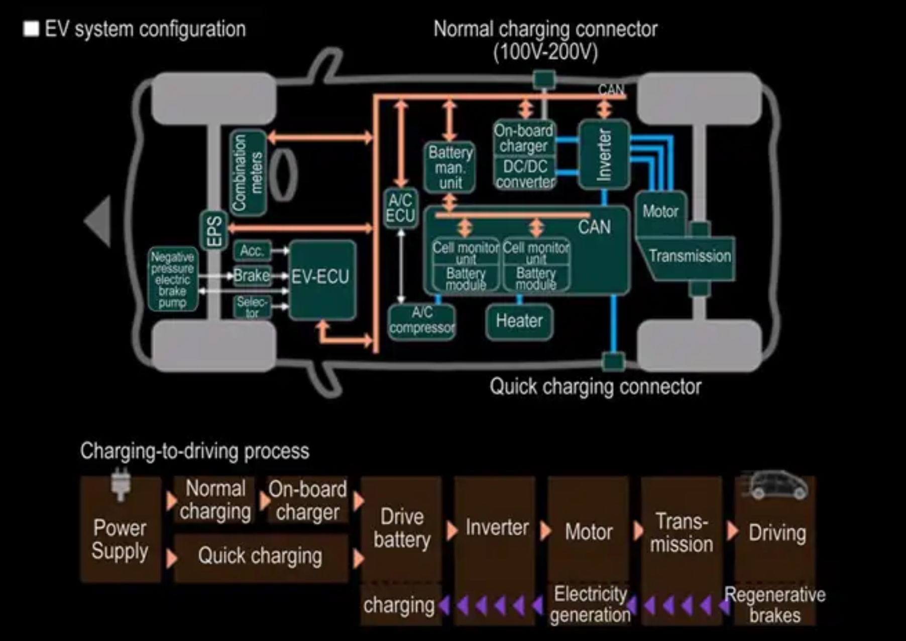
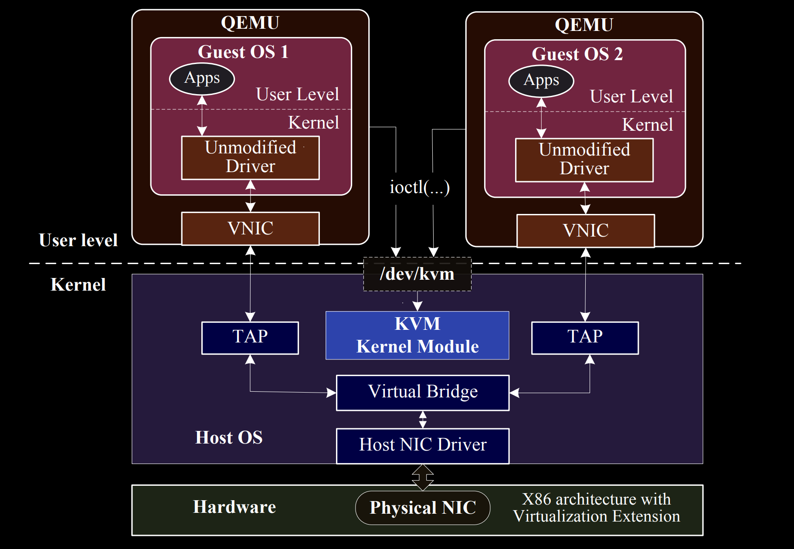
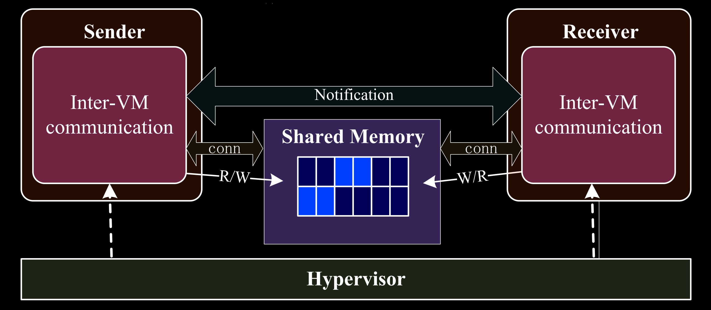
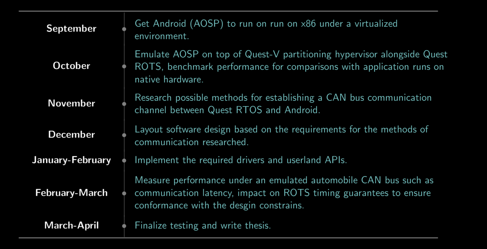

name: title-layout
layout: true
class: center, middle, title
---
name: basic-layout
layout: true
class: left, top
???
These two slides are the templates to be used for the rest of the presentation

---
name: title
template: title-layout
# Senior Thesis Progress Presentation
.footnote[Vijay Thakkar, Prof. Rich West]
???

---
name: thesis-statement
template: title-layout
#### Design a proof of concept system that allows for Android OS to be emulated on x86 hardware to serve as a host for low criticality (infotainment) processing in the presence of a high criticality sister guest. 
???
- Infrastructure for heterogenous mixed criticality compute for the cars of the future

---
name: can-cannot
.center[]
???
- CAN buses dominate communication in automobiles.
- But this is not scalable for modern cars that have very heavy compute needs.
- intedned for distributed computing and communication in the absence of a host processor

---
name: future-cars
template: title-layout
## Enter The Self-Driving Era

---
name: modern-needs
template: basic-layout
## Modern Cars, Modern Needs
- Many more sensors
- High bandwidth datapaths (USB, PCIe)
- Large screen based dash/HUD (Android Auto)
- Self driving modules (Drive-AGX)

---
name: modern-design
template: basic-layout
## Our Car Platform
- Quest-V Partitions hardware for OSes
- Quest controls high criticality control signal processing
- Linux hosts general purpose compute
- Android hosts low criticality info-tainment

---
name: consolidation-issues
template: basic-layout
## Issue With Consolidation
- Still need CAN/USB for control and infotainment
- But that breaks RTOS timing guarantees
???
- cannot let RTOS do everything even if consolidated
- Need different OSes so that we can process separately

---
name: solution
template: title-layout
## Share CAN buffer with another OS accross partitioned hardware

---
name: shared-nic-example
.center[]
???
- Historic method of setting up cross-vm comms.
- TCP overhead kills this in terms of latency.
- Also much more powerful than we need this to be

---
name: requirements
class: title, top
## Requirements
- Setup a shared memory region between two Guest OSes
- Provide low latency read-write access to it
- Preserve security aspects of virtualization
- Ensure no side-effects for high criticality processing of ROTS
.center[]

---
name: work-done
template: basic-layout
## Work Done
1. Android x86 running in a hypervisor
2. 3 potential methods researched
3. Ongoing implementation for ramdisk approach

---
name: method-1
template: basic-layout
## Quest-V Based Approach
1. Use Quest-V to configure MMU
2. Map slab of phys-mem to all guests
3. Agree on that region for DMA
4. Write drivers in guests to ensure a secure API for userland

---
name: method-2
template: basic-layout
## Linux Hypervisor - RAMdisk
1. Init ramdisk in host
2. Mount in guest OSes as a shared drive
3. Mmap the shared file and treat as shared memory

---
name: method-3
template: basic-layout
## Linux Hypervisor Approach-2
1. Init shared memory in KVM
2. Use 
3. Mmap the shared file and treat as shared memory

---
name: future-work
template: basic-layout
## Future Work
- Mixed criticality GPGPU compute for running inference?

name: timeline
class: middle, center

???
SLIDE 7: Timeline of work to be done
- Checkpoint one already done

name: questions
class: middle, center
### Questions?
