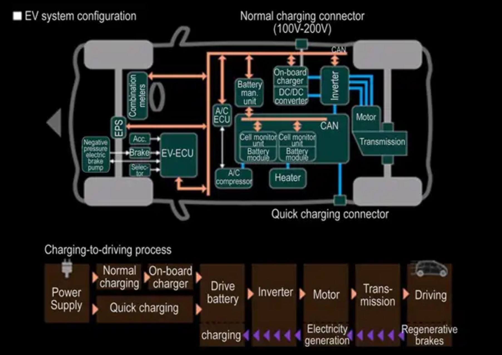
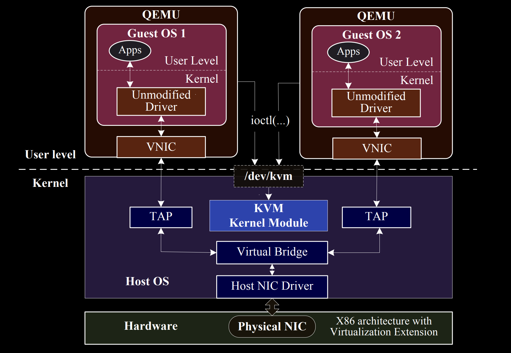

name: title-layout
layout: true
class: center, middle, title
---
name: basic-layout
layout: true
class: left, top
???
These two slides are the templates to be used for the rest of the presentation

---
name: title
template: title-layout
# Senior Thesis Progress Presentation
.footnote[Vijay Thakkar, Prof. Rich West]

---
name: thesis-statement
template: title-layout
#### Design a proof of concept system that allows for Android OS to be emulated on x86 hardware to serve as a host for low criticality (infotainment) processing in the presence of a high criticality sister guest.
???
- Infrastructure for heterogenous mixed criticality compute for the cars of the future

---
name: can-cannot
.center[]
???
- CAN buses dominate communication in automobiles.
- intedned for distributed computing and communication in the absence of a host processor

---
name: future-cars
template: title-layout
## Enter The Self-Driving Era

---
name: modern-needs
template: basic-layout
## Modern Cars, Modern Needs
- Many more sensors
- High bandwidth datapaths (USB, PCIe)
- Large screen based dash/HUD (Android Auto)
- Self driving modules (Drive-AGX)
- Need a CAN bus concentrator

---
name: modern-design
template: basic-layout
## Our Car Platform
- Quest-V Partitions hardware for OSes
- Quest controls high criticality control signal processing
- Android hosts low criticality info-tainment
- Future: Linux hosts general purpose compute

---
name: shared-nic-example
.center[]
???
- Historic method of setting up cross-vm comms.
- TCP overhead kills this in terms of latency.
- Also much more powerful than we need this to be

---
name: solution
class: title, top
## Tunneled Communication Architecture
- Hypervisor provides physical memory mapped to both OSes
- Setup async communication protocol through it (Simpson's 4 slot)
- Driver in Quest scans for read/write requests and provides minimal API
- Driver in Android takes user input and requests control changes
.center[]

---
name: work-done
template: basic-layout
## Work Done Since Last Time
- AOSP 'flavor' selection
- Reproducible, full Android build for UP2
- Android with root terminal
- Android disk partition consolidation

---
name: aosp-flavor
template: basic-layout
## Selecting Among AOSP
- Started with Android-x86 but met various build issues
- Settled on Project Celadon - Intel's AOSP Implementation for NUC

---
name: aosp-build
template: basic-layout
## Building Celadon
- Resolved build environemnt and depedency issues
- Worked on midifications to build config and code
- Documented full, reproducible build process

---
name: aosp-terminal
template: basic-layout
## Root Terminal
- Normal UserDebug build do not expose su binary or a root user
- Changed to ENG builds
- Changed SELinux policy
- Modified su and fs_config source to bypass permission checks
- Documentation

---
name: aosp-partitions
template: basic-layout
## Root Terminal
- Normal installation has about 10 disk partitions
- Researched and Documented Celadon/AOSP partitoins scheme
- Reduced 4 partitions, documented changed
- More extensively documented the Source tree and business logic

---
name: future-work
template: basic-layout
## Future Work
- Finish partition consolidation and make live installer
- Write Android driver to support qkMod tunnel
- Expose driver to userspace through the Android HAL and AppFramework
- Demonstrate PoC

---
name: questions
class: middle, center
### Questions?
